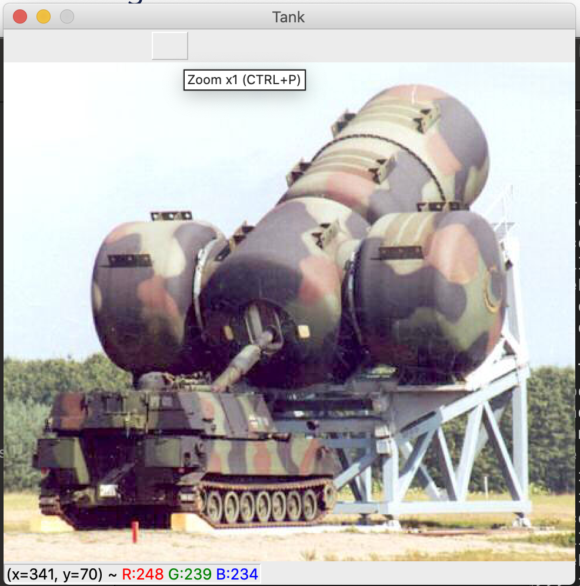

# OpenCV
## Open image
```python
    import cv2
    image = cv2.imread('images/tank.jpeg')
    image.shape
    >> (424, 486, 3)

    cv2.imshow("Tank", image)
    cv2.waitKey(0)
```


## Array attribute
```python
    image[200, 30]
    >> array([253, 252, 238], dtype=uint8)

    part = image[30: 200, 20: 100]
    cv2.imshow("Part", part)
    cv2.waitKey(0)
```


## Resize
```python
    resized = cv2.resize(image, (100, 100))
    cv2.imshow("Resized", resized)
    cv2.waitKey(0)
```


## Rotate
```python
    (w, h, c) = image.shape
    center = (w // 2, h // 2)
    matrix = cv2.getRotationMAtrix2D(center, -45, 1.0)  # last param is scale
    rotated = cv2.wrapAffine(image, matrix, (w, h))
    cv2.imshow("Rotated", rotated)
    cv2.waitKey(0)
```


## Blur
```python
    # Gaussian blur (11 by 11 is the kernel size)
    blurred = cv2.GaussianBlur(image, (11, 11), 0)  # last param is std of x or y if zero both caculate from kernel size
    cv2.imshow("Blurred", blurred)
    cv2.waitKey(0)
```


## Drawing
### Rectangle
``` python
    copy = image.copy()
    cv2.retangle(img=copy, pt1=(320, 60), pt2=(420, 160), color=(0, 0, 255), thickness=2)
    cv2.imshow("Draw rect", copy)
    cv2.waitKey(0)
```


### Circle
``` python
    copy = image.copy()
    cv2.circle(img=copy, center=(300, 150), radius=20, color=(0, 0, 255), thickness=2)
    cv2.imshow("Draw circle", copy)
    cv2.waitKey(0)
```


### Line
``` python
    copy = image.copy()
    cv2.line(img=copy, pt1=(60, 20), pt2=(420, 160), color=(0, 0, 255), thickness=2)
    cv2.imshow("Draw line", copy)
    cv2.waitKey(0)
```

