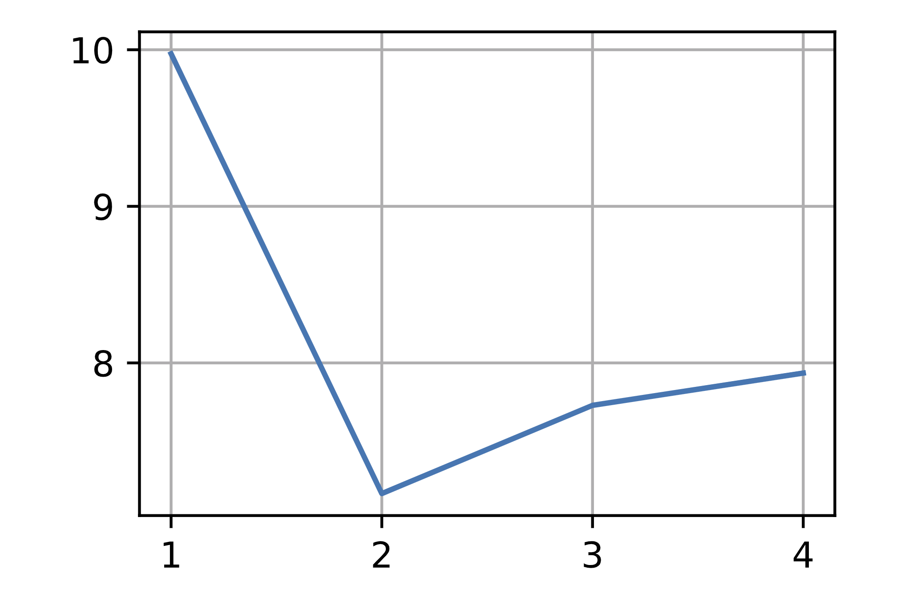
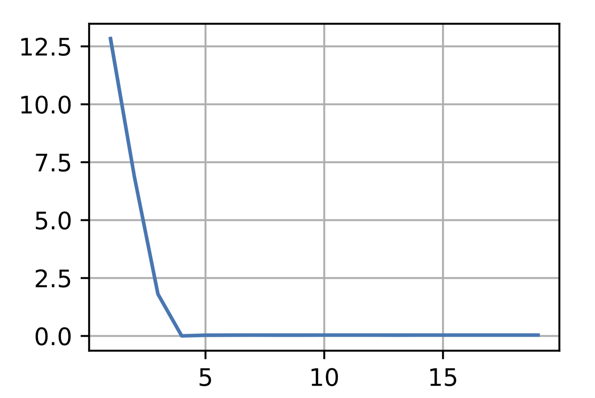
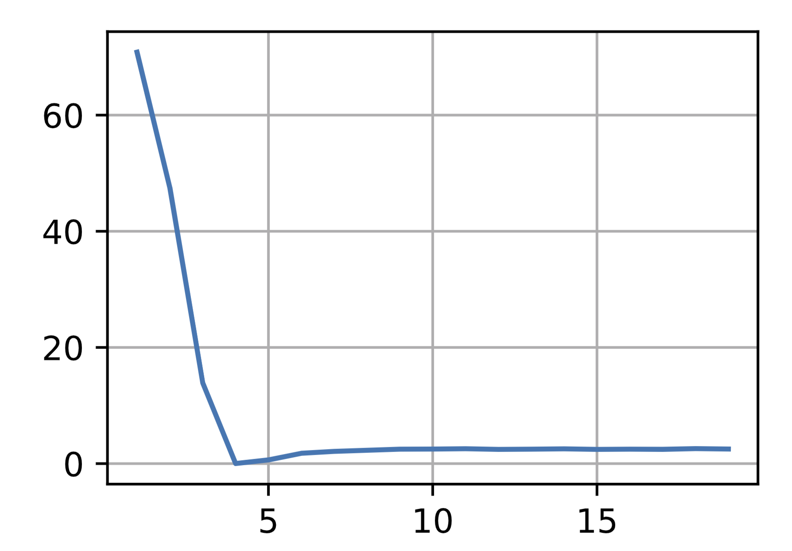
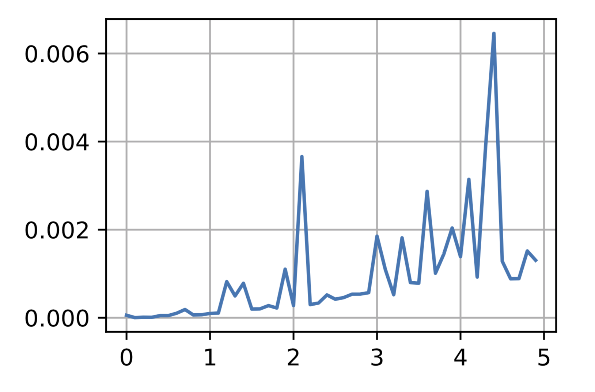
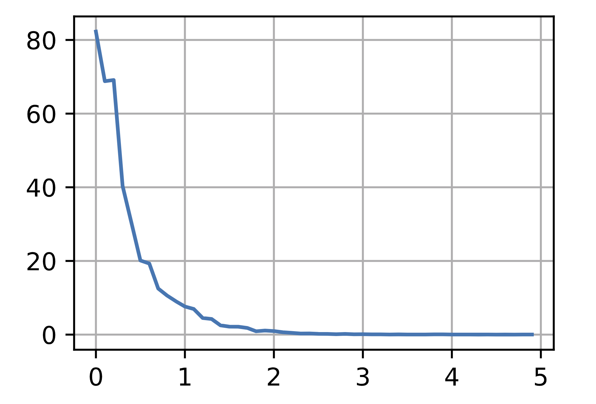

# Chương 3: Mạng nơ ron tuyến tính
---
## Hồi quy tuyến tính
### 1.
$b = \large{\sum_{i=0}^{n}\frac{x_{i}}{n}}$

Hàm số có dạng giống với hàm mất mát của hồi quy tuyến tính, và nghiệm của nó chính bằng giá trị kì vọng của tập dữ liệu

### 2.
Hàm mất mát có dạng

\[L(w) = \sum_{i=0}^{n}\frac{(y - Xw)^{T}(y - Xw)}{2n}\]

\[X = \begin{pmatrix}x_{00} & x_{01} & ... & x_{0d}\\
                     x_{10} & x_{11} & ... & x_{1d}\\
                     .& .& ...& .\\
                     .& .&...& .\\
                     x_{n0} & x_{n1} & ... & x_{nd}\end{pmatrix},
y = \begin{pmatrix}y_{1}\\y_{2}\\.\\.\\y_{n}\end{pmatrix},
w = \begin{pmatrix}w_{1}\\w_{2}\\.\\.\\w_{d}\end{pmatrix}\]

với d là số thuộc tính, n là số phần tử

Đạo hàm theo w:

\[L(w)^{'} = \sum_{i=0}^{n}\frac{X^{T}(Xw - y)}{2n} = 0\]

Kết quả nghiệm w:

\[w = (X^{T}X)^{-1}X^{T}y\]

Phương pháp này tốt khi số chiều của các phần tử trong tập dữ liệu không lớn hơn số phần tử (d < n) vì độ phúc tạp của phép nhân ma trận là khoảng $O(d^{2.4})$ đến $O(d^{3})$, ngược lại phương pháp này kém hiệu quả khi số thuộc tính của phần tử quá cao

### 3.
Xác suất của một phần tử :

\[p(y|x) = \frac{e^{-|y - w^{T}x|}}{2}\]

Hàm đối log với dữ liệu mô hình là:

\[\begin{align}
    -log(P(Y|X)) &= -\sum_{i=0}^{n}(log\frac{1}{2} - |y - w^{T}x|)\\
\end{align}\]

Nghiệm của bài toán không thể giải bằng phương trình gradient vì không thể tìm ra đạo hàm bằng 0

Nghiệm của bài toán có thể giải bằng SGD nhưng nhiệm của phương trình chưa chắc đã là nghiệm toàn cục

---

## Lập trình hồi quy truyến tính từ đầu
### 1.

Khi w = 0, thuật toán vẫn hoạt động

### 2.

Vì định luật ohm là định luật tuyến tính nên có thể tìm ra giá trị R thông qua autograd

### 3.
....

### 4.

Vấn đề là ta không biết được đạo hàm bậc nhất của biểu thức. Ta có thể lồng 2 autograd để tính

### 5.

Ta cần reshape vì y có shape là (1, n) trong khi đó y_hat có shape là (n, 1)

### 6.

Giá trị của hàm mất mát giảm nhanh khi lr cao nhưng giá lr quá cao thì không thể tìm thấy cực tiểu

### 7.

Thì các giá trị bị thừa sẽ được tính là 1 batch

---

## Lập trình súc tích hồi quy tuyến tính
### 1.

Cần vì khi đó loss sẽ là một giá trị đại số vì thế trainer cần chuyển step về 1

### 3.

autograd.grad(l, net[0].weight.data())

---

## Hồi quy softmax
### 1.
Áp dụng bất đẳng thức Jensen cho hàm lồi -log(x) : $\sum_{i=1}^{n} p_{i}f(q_{i}) \geq f(\sum_{i=1}^{n}p_{i}q_{i})$

\[\begin{align}
D(p || q) &= \sum p(x)log\frac{p(x)}{q(x)} \\
          &= -\sum p(x)log\frac{q(x)}{p(x)} \\
          &\geq -log(\sum p(x).\frac{q(x)}{p(x)}) \\
          &\geq -\sum log(1) & (\sum q(x) = 1)\\
          &\geq 0
\end{align}\]

### 2.

\[ log(\sum_{i=0}^{n} o_{i}) \]

### 3.

\[\begin{align}
\frac{\partial l(y, \hat{y})}{\partial o_{i}} = \frac{e^{o_i}}{\sum e^{o_j}} - y_{i}\\
\frac{\partial^2 l(y, \hat{y})}{\partial o_{i} ^2} = \frac{e^{o_i}.\sum e^{o_j} - e^{2o_i}}{(\sum e^{o_j})^2}
\end{align}\]

### 4.
Nếu thiết kế mã nhị phân cho 3 lớp thì ta sẽ cần tới là 2 kí tự, nhưng khi đó thì sẽ thừa tận 1 giá trị

Ta có thể thiết kế 0 cho lớp 1, 10 cho lớp thứ 2, 11 cho lớp thứ 3

---
## Bộ dữ liệu phân loại ảnh fashion-mnist

### 1.

Giảm batch_size sẽ tăng số vòng lặp để tách bộ dữ liệu từ đó sẽ tăng thời gian đọc

### 2.

---

## Lập trình hồi quy softmax từ đầu
### 1.

Khi đó giá trị của softmax sẽ rất là lớn dẫn tới việc tràn số(overflow)

### 2.

Khi mà giá trị của y mũ rất nhỏ thì hàm log này sẽ bị tràn số(overflow)

### 3.

Với hàm softmax, giá trị ta chia cả tử và mẫu cho một hằng số, thông thường ta sẽ lấy giá trị $e^{o_i}$ mà lớn nhất

Ta có thể dùng log-sum-exp trick để tính giá trị cross-entropy

### 4.

Việc trả về nhãn có giá trị dự đoán cao nhất đôi khi không có nhiều giá trị bằng việc trả các nhãn có thể xảy ra với 1 ngưỡng nào đó

### 5.

Khi số từ vựng quá lớn, giá trị xác suất của các nhãn sẽ rất nhỏ, dẫn đến sai số

---

## Cách lâp trình súc tích hồi quy softmax

### 1.
Khi điều chỉnh lr thì giá trị train loss giảm chậm hơn, khi tăng epoch thì test acc dần giảm so với train acc, batch_size tăng thì train loss giảm nhanh hơn

### 2.
Ta cần thêm l2 hoặc l1 để tránh overfitting

---

# Chương 4: Percepton đa tầng

---
## Percepton đa tầng
### 1.

\[ tanh'(x) = 1 - tanh^2(x)\]

\[ pRelu(x)= \left[
    \begin{array}\\
        1 & \mbox{if } x \geq 0\\
        \alpha & \mbox{else x < 0}
    \end{array}
    \right.
\]

### 2.
Khi các đoạn liên tục, khi đó $wx + b > 0$, ta có thể bỏ giá trị tuyệt đối của làm Relu

Khi đó giá trị của lớp percepton sau là: $x^{k} = f(x^{k-1})$, như vậy $y = w^{k}x^{k} + b^{k}= w^{k}f(x^{k-1}) + b^{k}$ là tuyến tính

### 3.

\[
    \begin{align}
        tanh(x) &= \frac{1 - e^{-2x}}{1 + e^{-2x}}\\
        tanh(x) + 1 &= \frac{2}{1 + e^{-2x}}\\
                    &= 2\sigma(2x)
    \end{align}
\]

### 4.
...

### 5.
Như vậy thì kết quả sẽ chẳng khác so với khi không có lớp tuyến tính

---

## Lập trình percepton đa tầng từ đầu
### 1.

Số lượng num_hiddens càng cao thì độ chính xác của tập test càng lớn nhưng dễ bị overfitting

### 2.
Thêm 1 tầng ẩn độ chính xác cao hơn

### 3.
Tốc độ học càng thấp thì train loss càng chậm, lr=0.01

### 4.
...

### 5.
Vì phải kết hợp quá nhiều tham số

### 6.
Thay đổi 1 tham số và giữ nguyên các tham số còn lại

## Cách lập trình súc tích percepton đa tầng
### 1.
...

### 2.
Hàm relu có tốc độ học nhanh và kết quả mang lại tốt hơn các hàm kích hoạt khác

### 3.
...

---

## Lựa chọn mô hình, dưới khớp, quá khớp
### 1.
Áp dụng giải bài toán hồi quy tuyến tính với w là hệ số của từng bậc trong đa thức

### 2.

Train

Test

### 3.

Việc bỏ qua chuẩn hoá đặc trưng làm thay đổi hình dáng đồ thị nhưng kết quả tìm w vẫn giữ nguyên

### 4.
> 5

### 5.
...

## Suy giảm trọng số
### 1.

Train

Test

### 2.
Giá trị tối ưu cho tập kiểm định có thể chưa tối ưu nhưng nó là giá trị tốt nhất để ta có thể kiểm định tập huấn luyện

### 3.
\[ w = w - \frac{\partial L(w, b)}{\partial w} - \lambda \]

### 4.
\[ w = (X^{T}X + \lambda)^{-1}X^{T}y\]

### 5.

Dừng train khi thấy giá trị mất mát huấn luyện lớn hơn giá trị mất mát kiểm định

### 6.

Giá trị P(w) đóng vai trò như là giả định về w, nó đóng vai trò để điều chỉnh w có hướng về giá trị giả định như vậy sẽ điều chuẩn được mô hình

---

## Dropout

### 1.

Khi tráo đổi giá trị của 2 lớp thì lớp huấn luyện giảm chậm hơn nhưng giá trị thấp hơn, trong khi đó độ chính xác của mô hình co xuy hướng tăng

### 2.

Giá trị chính xác của mô hình khi có dropout giảm chậm hơn so với mô hình không có khi epoch tăng

### 3.

### 4.

Dropout không được dùng khi test bởi vì giá trị đầu ra của mô hình có thể rất khác với giá trị thực

### 5.

Dùng suy giảm trọng số cho kết quả không bằng trên tập dữ liệu kiểm định so với dropout nhưng khi kết hợp cả 2 lại cho kết quả tốt nhất

### 6.
Khi đó có thể giá trị trong ma trận trọng số có thể không bao giờ được huấn luyện(bằng với xác suất dropout)

### 7.

Thay vì tắt hẳn hàm kích hoạt thì có thể cho nó giảm x phần trăm
