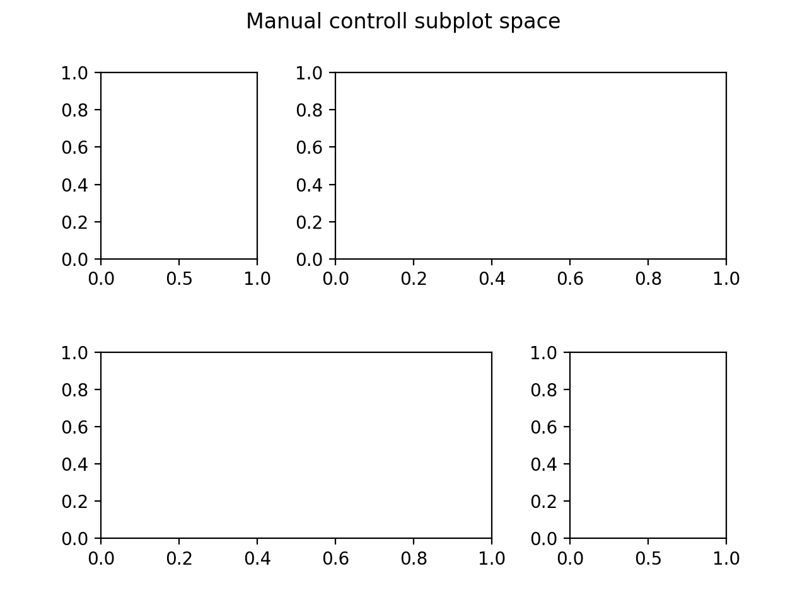

# Matplotlib

```
    import matplotlib.pyplot as plt
```

# Color
``` python
CB91_Blue = '#2CBDFE'
CB91_Green = '#47DBCD'
CB91_Pink = '#F3A0F2'
CB91_Purple = '#9D2EC5'
CB91_Violet = '#661D98'
CB91_Amber = '#F5B14C'
```

# Tick & Label
``` python
    fig, ax = plt.subplots()
    ax.set_title("title")
    ax.set_ylabel("ylabel")
    ax.set_xlabel("xlabel")
```

# Subplot
## Easy way
``` python

    plt.subplots((x_dim, y_dim), sharex=True, sharey=True, gridspec_kw={'hspace': 0, 'wspace': 0})
    # gridspec_kw : use to determine space between subplot

```
## Hard way
``` python
    fig = plt.figure()
    fig.suptitle("Manual controll subplot space")
    grid = plt.GridSpec(2, 3, wspace=0.5, hspace=0.5)
    plt.subplot(grid[0, 0])
    plt.subplot(grid[0, 1:])
    plt.subplot(grid[1, :2])
    plt.subplot(grid[1, 2])
```



# PLot line
``` python
    fig, ax = plt.subplots()
    ax.plot(X, y, linewidth=2, color=CB91_Blue, linestyle='--', marker='o')

    # line style
    linestyle: --; .;

    # marker
    marker: o;
```
# Scatter
``` python
    fig, ax = plt.subplots()
    ax.scatter(X, Y)
```

# Bar
``` python
    fig, ax = plt.subplots()
    ax.bar(X, Y)
```
# Show  image
``` python
    fig, ax = plt.subplots()
    ax.imshow(X)
```


# Contour
``` python
    fig, ax = plt.subplots()
    ax.contourf(X)
```

# Pie
``` python
    fig, ax = plt.subplots()
    ax.contourf(X)
```

# Save file
``` python
    plt.save("filename")
    # dpi
```
